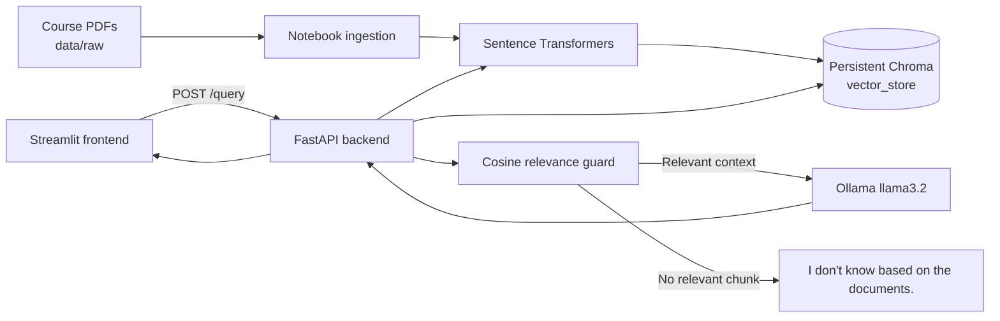

# RAG Document Assistant

A simple graduation-project RAG assistant for asking questions about course notes in PDF form. The system extracts PDF text, creates overlapping chunks, stores semantic embeddings in Chroma, retrieves relevant evidence, and generates answers with local Ollama models. Answers are restricted to the retrieved documents and include readable file/page citations.

## Architecture



## Tech stack

- Python 3.13
- Streamlit and Requests
- FastAPI and Uvicorn
- ChromaDB with cosine similarity
- Sentence Transformers: `all-MiniLM-L6-v2`
- Ollama with `llama3.2`
- PyPDF for extraction
- Pytest for backend tests

## Project structure

```text
rag-assistant-project/
├── backend/
│   ├── app/
│   ├── data/vector_store/
│   ├── tests/
│   ├── requirements.txt
│   └── Dockerfile
├── data/raw/                 # local PDFs; ignored by Git
├── frontend/
│   ├── app.py
│   ├── api_client.py
│   ├── requirements.txt
│   └── .env.example
└── notebooks/rag_pipeline.ipynb
```

## Domain and data

The corpus contains course notes covering Neural Networks, Problem Solving, Patterns, Assembly, and Artificial Intelligence. Raw PDFs are intentionally not committed because they are local course material and may be large or copyrighted. To reproduce the index, place the PDFs in `data/raw/` and run all cells in `notebooks/rag_pipeline.ipynb`.

The generated Chroma store is about 10.5 MB, below the 50 MB project limit, so it remains committed. The raw PDFs remain ignored.

## Setup

### 1. Python environment

From the project root:

```powershell
.\.venv\Scripts\Activate.ps1
```

Install backend and frontend dependencies:

```powershell
pip install -r backend\requirements.txt
pip install -r frontend\requirements.txt
```

### 2. Ollama

Install and start Ollama, then download the default model:

```powershell
ollama pull llama3.2
```

Ollama should be available at `http://localhost:11434`.

### 3. Environment variables

Copy `.env.example` files only when needed. The frontend already has a local `.env` for development; it is ignored by Git.

| Variable | File | Default | Purpose |
|---|---|---|---|
| `FRONTEND_ORIGIN` | `backend/.env` | `http://localhost:3000` | Allowed browser origin for API CORS |
| `OLLAMA_BASE_URL` | `backend/.env` | `http://localhost:11434` | Ollama server URL |
| `LLM_MODEL` | `backend/.env` | `llama3.2` | Optional Ollama model override |
| `API_BASE_URL` | `frontend/.env` | `http://localhost:8000` | FastAPI URL used by Streamlit |

### 4. Start the backend

```powershell
cd backend
..\.venv\Scripts\python.exe -m uvicorn app.main:app --host 127.0.0.1 --port 8000
```

### 5. Start the frontend

In a second terminal:

```powershell
cd frontend
..\.venv\Scripts\python.exe -m streamlit run app.py
```

Open the Streamlit URL shown in the terminal, normally `http://localhost:8501`.

## API reference

### `GET /health`

```powershell
curl http://localhost:8000/health
```

Expected response:

```json
{"status":"ok"}
```

### `POST /query`

```powershell
curl -X POST http://localhost:8000/query `
  -H "Content-Type: application/json" `
  -d '{\"question\":\"What is a neural network?\"}'
```

Response shape:

```json
{
  "answer": "A cited answer grounded in the documents.",
  "sources": ["Neural lect1.pdf, pages 5-6"]
}
```

If no retrieved chunk passes the cosine-distance relevance guard, the API returns `I don't know based on the documents.` and an empty source list without calling Ollama.

## Evaluation

The notebook evaluation uses eight in-scope questions and two deliberately out-of-scope questions.

- **In-scope:** 7/8
- **Out-of-scope refusals:** 2/2

| Question | Result |
|---|---|
| Activation function purpose | Yes |
| Backpropagation purpose | Yes |
| Heuristic in problem solving | Yes |
| Aim of the problem-solving course | Yes |
| Pattern recognition | Yes |
| Assembler conversion | Yes |
| CPU register vs. main memory | No |
| Artificial intelligence goals | Yes |
| Capital of France (out of scope) | Yes, refused |
| Tomorrow's weather (out of scope) | Yes, refused |

The remaining in-scope failure is a generation limitation: relevant register evidence is retrieved, but `llama3.2` may still provide an insufficient answer. The two unsupported original questions about breadth-first search/design patterns/assembly stacks were replaced after a plain-text corpus audit showed that those topics were absent or unrelated in the PDFs. The relevance threshold was tuned on this small test set, so it should be revalidated with a larger, representative evaluation set before production use.

## Screenshots

Add project screenshots here:


## Git

The first local commit contains the application code, notebook, configuration, tests, and the sub-50 MB vector store. It does not include `.env`, `.venv`, logs, checkpoints, or raw PDFs. No remote push is configured or performed.
